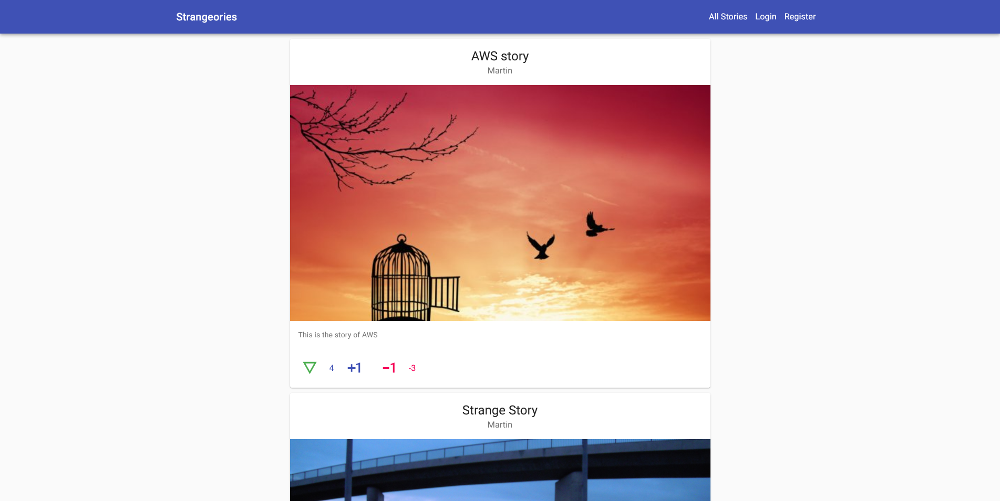

<h1 align="center">Strangeories - FrontEnd</h1>

> Web app to post and fetch strange stories from an API. ( You can find the [backend repo here](https://github.com/martinnajjar12/strangeories_backend)). Whenever you feel bored, and want to hear a weird story, you can move here to listen to some different stories.



<p align="center">Screenshot</p>

<p>Additional description about the project and its features.</p>

## Built With

- Next JS
- TypeScript
- Material UI

## Features

- Guests can see and read stories, but they can't like, dislike it or create a story.
- Guests can create account which will be stored in the database.
- Whoever have an account can login to access all the features.
- User can like, dislike and create new stories which will be stored in a database while the picture will be stored in AWS S3 Bucket.

**Email and password to check the app:**
Email: martin@martinnajjar.tech
password: 123456


## Live Demo

[Live Demo Link](https://strangeories.vercel.app/)


## Getting Started


To get a local copy up and running follow these simple example steps.

### Prerequisites

- NodeJS
- TypeScript
- Code Editor

### Setup

Open up a terminal (after installing Git) and run the following command:

```bash
git clone https://github.com/martinnajjar12/calories-frontend
```

and hit Enter.

**OR**

Download a zip version of the project from the above button.

### Install

To install the required dependencies run this command in your terminal:

```Node
npm install
```

### Usage

In order to open it in your browser, you need to dispatch the following command:

```Node
npm run dev
```

**Note:** You will not be able to interact with the server because of CORS (Cross-Origin Resource Sharing) restriction.

## Authors

👤 **Martin Najjar**

- GitHub: [Martin Najjar](https://github.com/martinnajjar12)
- Twitter: [Martin Najjar](https://twitter.com/martin_najjar)
- LinkedIn: [Martin Najjar](https://linkedin.com/in/martinnajjar12)

## 🤝 Contributing

Contributions, issues, and feature requests are welcome!

Feel free to check the [issues page](https://github.com/martinnajjar12/strangeories/issues).

## Show your support

Give a ⭐️ if you like this project!

## Acknowledgments

- App idea by me 😉

## 📝 License

This project is MIT licensed.